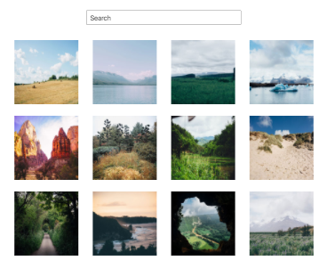
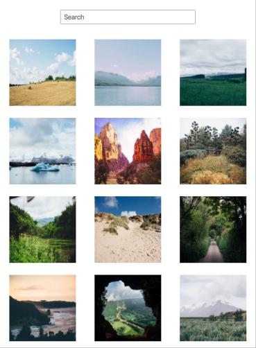
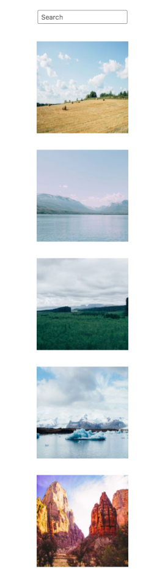
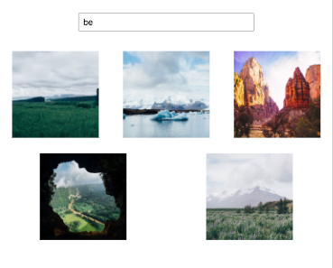
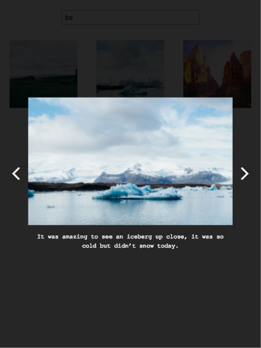
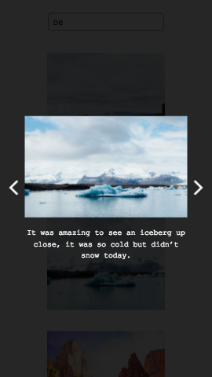

# TTH FrontEnd - P04 - Interactive Photo Gallery

## Introduction

This is the fourth of the Team Treehouse Techdegree . The complete instruction of the project can be seen in [project_instructions.pdf](https://github.com/wahidyankf/treehouse-frontend-04-interactive-photo-gallery/blob/master/project_instructions.pdf), and the initial code and assets can be seen in the `initial_assets` folder.

## Usage

### Demo pages

You can see the demo page [here](https://wahidyankf.github.io/treehouse-frontend-04-interactive-photo-gallery/).

### Result

The result can be seen in the gh-pages branch of this repository.

### The Source

The source of this app can be seen in the src folder of master branch. 

## Testing

This app was tested using [HTML](https://validator.w3.org/) and [CSS](https://jigsaw.w3.org/css-validator/) validator.

## Sreenshots

### Home - Large Display

### Home - Medium Display

### Home - Small Display

### Search Box Demo

### Lightbox - Large Display

### Lightbox - Small Display

## License

[MIT](https://en.wikipedia.org/wiki/MIT_License).